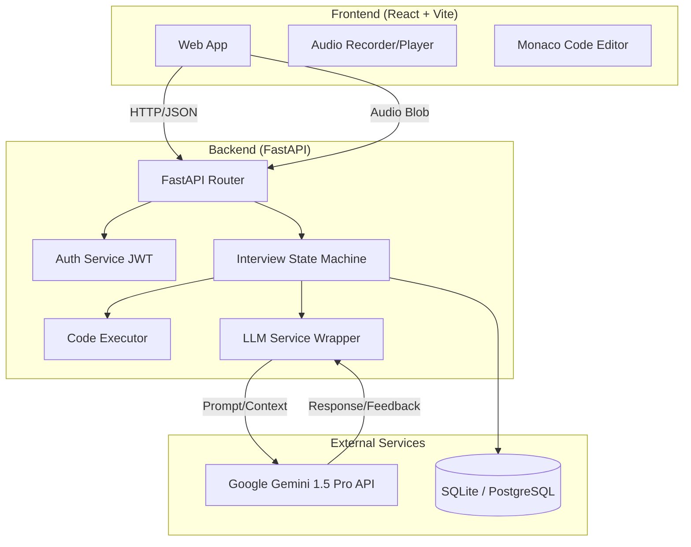

# 🤖 Automated Technical Interviewer


> **A next-generation AI-powered platform for conducting automated, adaptive, and realistic technical interviews.**

---

## � Table of Contents

- [Overview](#-overview)
- [Key Features](#-key-features)
- [System Architecture](#-system-architecture)
- [Tech Stack](#-tech-stack)
- [Getting Started](#-getting-started)
  - [Prerequisites](#prerequisites)
  - [Backend Setup](#backend-setup)
  - [Frontend Setup](#frontend-setup)
- [Usage Guide](#-usage-guide)
- [API Documentation](#-api-documentation)
- [Project Structure](#-project-structure)
- [Troubleshooting](#-troubleshooting)
- [Roadmap](#-roadmap)

---

## 🔍 Overview

The **Automated Technical Interviewer** is designed to streamline the recruitment process by autonomously conducting initial technical screening rounds. Unlike standard quiz-based platforms, this system leverages **Google's Gemini 1.5 Pro LLM** to simulate a human interviewer. It reads resumes, asks context-aware questions, evaluates code in real-time, and even holds spoken conversations using speech synthesis and recognition.

## ✨ Key Features

| Feature | Description |
| :--- | :--- |
| **📄 Resume Analysis** | Automatically parses PDF/Docx resumes to extract skills and projects, tailoring the interview context. |
| **🧠 Adaptive AI Interviewer** | Uses Gemini 1.5 Pro to generate dynamic follow-up questions based on candidate responses, not just static scripts. |
| **💻 Interactive Coding Environment** | Full-featured code editor with syntax highlighting and server-side execution (Sandbox). |
| **🗣️ Voice-Enabled Interaction** | Real-time Speech-to-Text (STT) and Text-to-Speech (TTS) for a natural conversational experience. |
| **🛡️ Comprehensive Assessment** | Covers **MCQ (CS Fundamentals)**, **DSA (Coding)**, and **System Design**. |
| **📊 Automated Scoring & Feedback** | Generates detailed performance reports immediately after the interview. |

## 🏗 System Architecture



## 🛠 Tech Stack

### **Backend**
-   **Framework:** [FastAPI](https://fastapi.tiangolo.com/) (High-performance Async Python)
-   **Database:** SQLite + `aiosqlite` (Dev) / PostgreSQL (Prod)
-   **AI Model:** Google Gemini 1.5 Pro
-   **Speech:** `gTTS` (Google Text-to-Speech)
-   **ORM:** SQLAlchemy (Async)

### **Frontend**
-   **Framework:** React (Vite)
-   **Language:** TypeScript
-   **Styling:** Tailwind CSS + Lucide React (Icons)
-   **State:** React Hooks + Context API
-   **HTTP Client:** Axios

---

## � Getting Started

Follow these steps to set up the project locally.

### Prerequisites
-   **Python 3.10+**
-   **Node.js 16+** & **npm**
-   **Google Cloud API Key** (with access to Gemini API)

### Backend Setup

1.  **Clone the repository:**
    ```bash
    git clone https://github.com/yourusername/automated-technical-interviewer.git
    cd automated-technical-interviewer/backend
    ```

2.  **Create virtual environment:**
    ```bash
    python -m venv venv
    
    # Windows
    venv\Scripts\activate
    
    # Mac/Linux
    source venv/bin/activate
    ```

3.  **Install dependencies:**
    ```bash
    pip install -r requirements.txt
    pip install aiosqlite  # Required for async SQLite
    ```

4.  **Configure Environment:**
    Create a `.env` file in the `backend/` directory:
    ```env
    GEMINI_API_KEY=your_google_api_key_here
    DATABASE_URL=sqlite+aiosqlite:///./interview.db
    # REDIS_URL=redis://localhost:6379/0 (Optional)
    ```

5.  **Run the Server:**
    ```bash
    uvicorn app.main:app --reload
    ```
    ✅ Server running at: `http://localhost:8000`  
    📄 API Docs: `http://localhost:8000/docs`

### Frontend Setup

1.  **Navigate to frontend directory:**
    ```bash
    cd ../frontend
    ```

2.  **Install dependencies:**
    ```bash
    npm install
    ```

3.  **Start Development Server:**
    ```bash
    npm run dev
    ```
    ✅ App running at: `http://localhost:5173`

---

## � Usage Guide

1.  **Registration**: Sign up as a new candidate on the landing page.
2.  **Resume Upload**: Upload your resume (PDF/DOCX) to initialize the session.
3.  **Online Assessment (OA)**:
    -   Complete the **MCQ Round** (CS Fundamentals).
    -   Solve the **Coding Challenge** in the integrated editor.
4.  **Technical Rounds**:
    -   **Round 1 (DSA)**: Explain your logic and optimize solutions.
    -   **Round 2 (System Design)**: Discuss architecture for scalable systems.
5.  **Completion**: Review your automated feedback report (Coming Soon).

---

## 🔌 API Documentation

| Endpoint | Method | Description |
| :--- | :--- | :--- |
| `/auth/login` | `POST` | Authenticates user & returns JWT. |
| `/candidates/upload_resume` | `POST` | Uploads and parses resume file. |
| `/interview/{id}/state` | `GET` | Retrieves current round and session status. |
| `/interview/{id}/chat` | `POST` | Sends text message to AI interviewer. |
| `/interview/{id}/speak` | `POST` | Sends audio blob for voice interaction. |
| `/interview/{id}/run_code` | `POST` | Executes python code in sandbox. |

---

## 📂 Project Structure

```bash
├── backend/
│   ├── app/
│   │   ├── routers/        # API route handlers
│   │   ├── services/       # Core business logic (LLM, Flow, Code Exec)
│   │   ├── models.py       # Database schemas
│   │   └── main.py         # Application entry point
│   ├── requirements.txt
│   └── .env
│
├── frontend/
│   ├── src/
│   │   ├── components/
│   │   │   └── interview/  # Interview specific UI components
│   │   ├── pages/          # Full page layouts
│   │   └── context/        # Global state
│   └── package.json
```

---

## ❓ Troubleshooting

-   **`socket.gaierror` on Startup**: Check logic in `database.py`. Ensure `.env` is loaded *before* `DATABASE_URL` is accessed.
-   **Gemini 404 Error**: Verify your API key and ensure the model `models/gemini-pro-latest` or `gemini-1.5-pro` is available in your region.
-   **Database Locks**: If using SQLite, avoid opening the database file in other viewers while the app is writing.

## 🗺 Roadmap

- [ ] **WebSocket Integration**: For lower latency voice and chat streaming.
- [ ] **Proctoring**: Webcam integration for identity verification.
- [ ] **Multi-Language Support**: Support for Java/C++ in code execution.
- [ ] **Admin Dashboard**: For recruiters to review candidate sessions.

---

> Built with ❤️ by the Automated Technical Interviewer Team.
